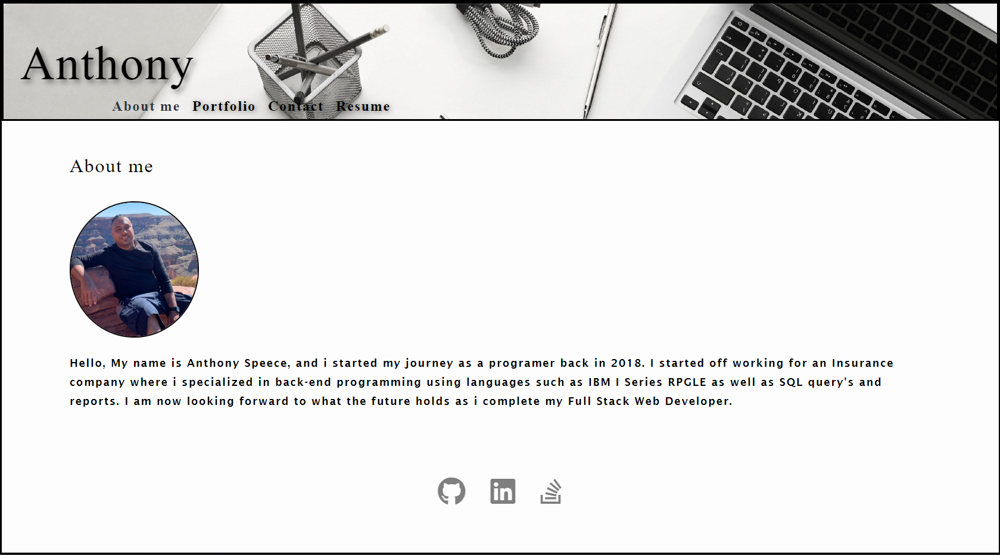
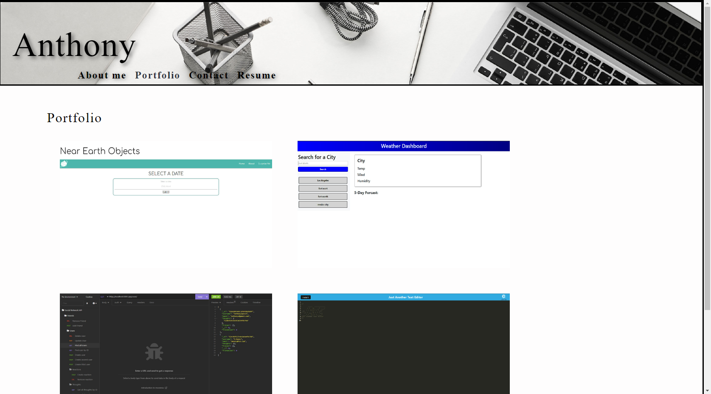
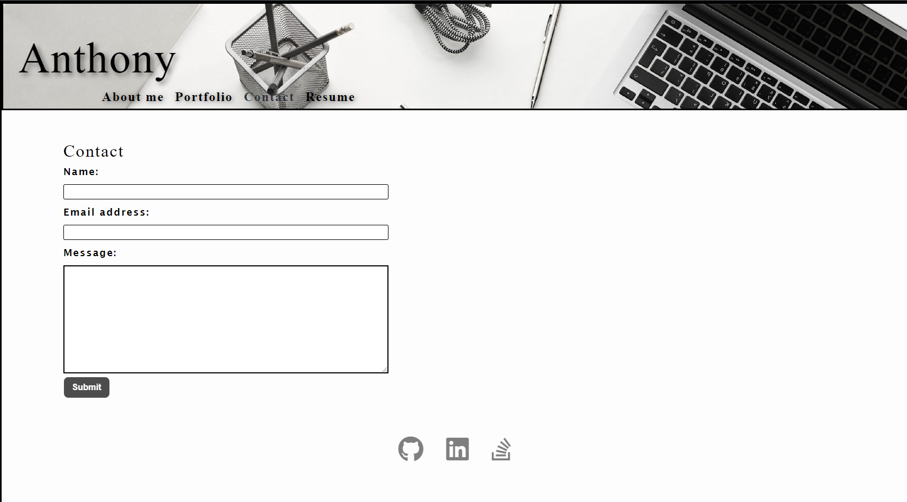
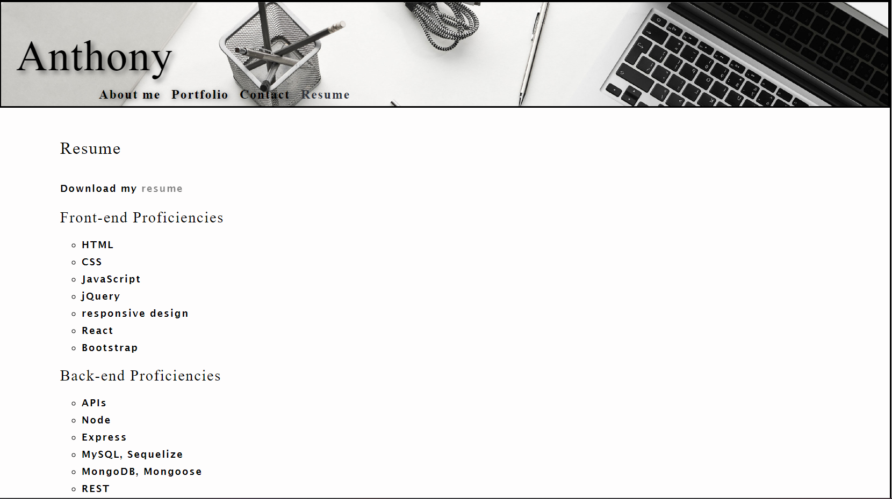

# React Portfolio

## Table of Contents:

1. [Description](#description)
2. [Installation](#installation)
3. [Usage](#usage)
4. [License](#license)
5. [Contributing](#contributing)
6. [Test](#tests)
7. [Questions](#questions)

## Description:

Create a personal portfolio of the work that has been done in class featuring the usage of REACT

## Installation:

NPX React is needed

## Usage:

The application is used to show and about me, contact, a portfolio of projects as well as my resume.

## License:

MIT
[Link to license](https://opensource.org/licenses/MIT)

## Contributing:

Anthony Speece is contributing to this project

## Tests:

user testing

## Questions:

GitHub Username: A-Speece
Email: anthonyspeece@gmail.com
Heroku application URL:https://react-portfolio-challenge.herokuapp.com/

